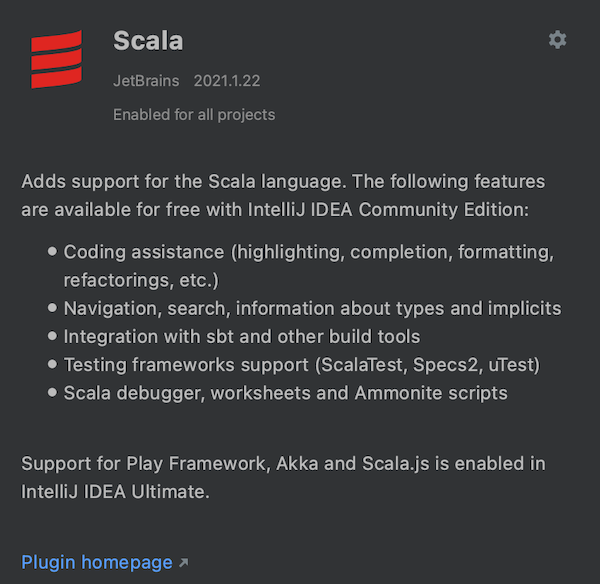
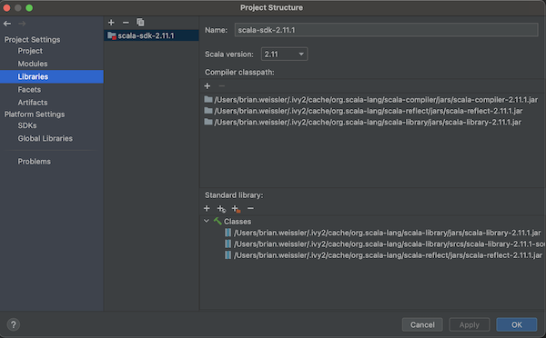
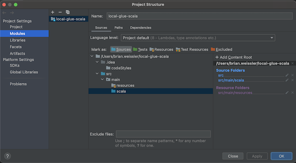
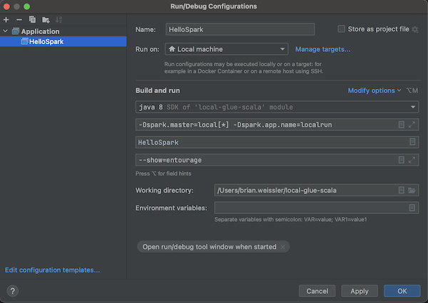

# local-glue-scala

Developing AWS Glue jobs __locally__ using Scala can be helpful when you want to benefit from the features of your
IDE, such as IntelliJ IDEA.  Luckily, AWS provides their Glue SDK via a repository that can be referenced via Maven
(and likely sbt, though I have not tried).

[This post](https://docs.aws.amazon.com/glue/latest/dg/aws-glue-programming-etl-libraries.html#develop-local-scala) 
is rather straightforward to follow.  Here, I will offer a few [additional tips for developing in IntelliJ](#tips).  And,
some [gotcha's](#gotchas) that tripped me up.

# Tips

## Scala Plugin
Be sure to have the Scala framework plugin installed.



## Project Setup
Create your __maven project__, but then you need a couple additional steps.

Be sure to include the Scala SDK in your project (⌘,).



Set up your modules properly.



## Run Configurations
Create a run configuration for the class you want to run.

__VM Options__
```
-Dspark.master=local[*] -Dspark.app.name=localrun
```

__Program Arguments__ (if desired)
```
--show=entourage
```



## Logging
By default, the SDK logs a lot.  Do yourself a favor and add `log4j.properties` to `src/main/resources`, and optionally
use the GlueLogger -- an example is in this repo.

> This logging is only carried through to Glue in AWS if you upload the `log4.properties` file to S3 and use the
> `--extra-files` special job parameter when configuing your Glue job.

# MySQL
One thing we tend to do is use the Glue `getSource` method to connect to data, for example in MySQL.  To play with this,
you can ...

> Notice, we had to add the `mysql-connector-java` dependency to the `pom.xml`.

## Start a MySQL Docker Container
```
docker run --name mysql -e MYSQL_ROOT_PASSWORD=mysql -p 3306:3306 -d mysql:8.0.27
```

## Create a Schema and Table
Connect to your MySQL at `localhost` on port `3306` with user `root` and password `mysql` (notice, `MYSQL_ROOT_PASSWORD` in the Docker command).

Create a schema called `bar` and a table called `baz`.

```
create schema bar;

create table bar.baz (k int, v varchar(100));

insert into bar.baz values (1, 'uno');
insert into bar.baz values (2, 'dos');
```
  
### Run a Test
Copy the above `HelloSpark.scala` config to run `HelloMySQL.scala`.  Run it.


# Gotchas
Make sure you are using the right Scala SDK version, as specified [here](https://docs.aws.amazon.com/glue/latest/dg/aws-glue-programming-etl-libraries.html#develop-local-scala).

Make sure you are using the right Java JDK version for your Scala version, as specified [here](https://docs.scala-lang.org/overviews/jdk-compatibility/overview.html).

If you get an error like `java.lang.NoSuchMethodError: scala.Predef$.` blah blah blah, this [stackoverflow answer](https://stackoverflow.com/a/46521546) 
clued me in that I had a conflicting Scala SDK in my Global Libraries configuration in IntelliJ.
